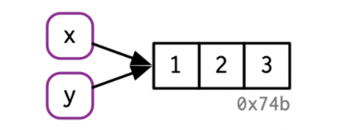
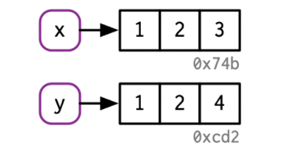
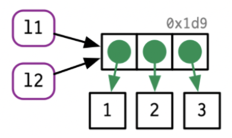
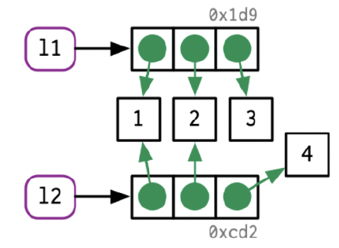
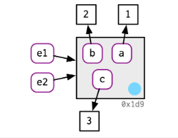
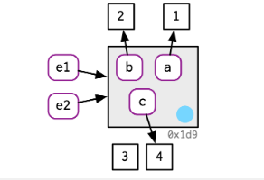
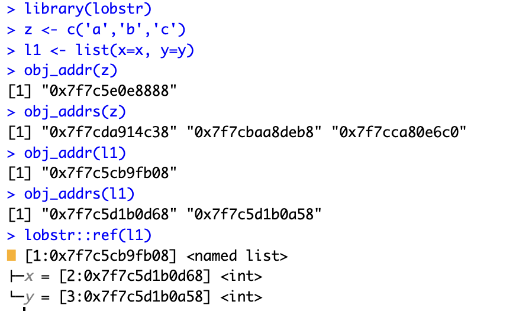

# Course Objectives

## Course objectives

- Make you R **programmers** rather than just R **users**, by 
working through most of the book "Advanced R" by Hadley Wickham: https://adv-r.hadley.nz/index.html
- Topics:
    - R objects: names and values
    - Basic data structures and programming.
        * vectors, subsetting, control flow, functions, environments
        * No tidyverse this time
    - R packages (based on the [online text](https://r-pkgs.org) 
    by Wickham and Bryan)
    - Object-oriented programming in R
    - Code performance: debugging, profiling, memory, calling 
    Python, or C++ from R
    - Parallelizing R code (if time permits)

## Getting started with R, RStudio and git

- Follow the ``getting started'' instructions on the class canvas 
page to get set up with R, RStudio and git.
    * R and RStudio will be familiar, but you may not have used git
    before, so leave some time for that.
- Please try to get R and RStudio installed and 
create an RStudio project linked to the class GitHub 
repository (or a forked copy) as soon as possible.
- Those still having trouble after the weekend should ask our TA, Sidu Wu,
for help during the first lab sessions in week 3. 
    - **Note: No lab this week**.


# Git and GiHub

## What is Git

- Git is a popular high-quality version control system. By tracking and logging the changes you make to your file or file sets over time, the version control system allows you to review or even restore earlier version. 
- Git is installed and maintained on your local system (rather than the cloud). 
- Git is responsive, easy to use and inexpensive (free, actually)
- Git is command based. But GitHub Desktop is an application that enables you to interact with GitHub using a GUI instead of the command line or a web browser. 

{width=40%}


## What is GitHub
  
- **GitHub** is an online project repository hosting platform which is used for storing, tracking and collaborating on software projects.

{width=30%}


- **GitHub**, can be divided into the **Git** and the **Hub**. 
  * The ``Git" implies the version control system; a tool which allows developers to keep track of the constant revisions of their code.
  * The ``Hub" is the community of like-minded individuals who participate. It is all about the collaborative effect of the community, in reviewing, improving, and deriving new ideas from the uploaded code. 

## Why you should use GitHub

The main benefits of using Github

1. Enhanced collaboration and track changes in your code across versions. It keeps track revisions - who changed what, when and where those files are stored.  
2. Make your contribution to open-source projects. 
3. By using GitHub, you make it easier to Get Excellent documentation. 
4. Showcase your work. GitHub is the best tool for you to attract recruiters. 
5. Once you are a verified GitHub Campus Student, you could create private repos and access various developer tools from GitHub's partners.

## Git vs GitHub

{width=100%}

## Reading 

- Welcome, Preface and Chapters 1,2 of the text.

# R objects (ch 1 & 2)

## R objects

- In R, data structures and functions are all referred to 
as "objects".
- Objects are created with the assignment operator `<-`; e.g.,  
`x <- c(1,2,3)`.
    - The objects a user creates from the R console are contained in
    the user's workspace, called the global environment. 
    - Use `ls()` to see a list of all objects in the workspace. 
    - Use `rm(x)` to remove object `x` from the workspace.
    
## Digging deeper

* The above understanding is an over-simplification that
is usually OK, but will sometimes lead to misunderstandings
about  memory usage and when R makes copies of objects
* Object copying is a **major** source of computational overhead in R,
so it pays to understand what will trigger it.
- Reference: text, chapter 2

## Binding names and to objects

- The R code `x <- c(1,2,3)` does two things: (i) creates
an object in computer memory 
that contains the values 1, 2, 3 and (ii) "binds" that object to the 
"name" `x`.

\small

```{r}
# install.packages("lobstr")
library(lobstr)
x <- c(1,2,3)
ls()
obj_addr(x) # changes every time this code chunk is run
```

\normalsize

## Binding multiple names to the same object

* The following binds the name `y` to the same object
that `x` is bound to.

\small

```{r}
y <- x
obj_addr(y)
```

\normalsize
{width=60%} 


## Aside: Syntactic *vs* non-syntactic

* Valid, or "syntactic" names in R can consist of letters, digits, . 
and _ but should start with a letter.
* Names that start with . are hidden from directory listing with `ls()`.
* Names that start with _ or a digit are non-syntactic and will cause
an error.
* If you need to create or access a non-syntatic name, use backward
single-quotes ("backticks").

\small

```{r}
x <- 1
.x <- 1
`_x` <- 1
ls()
```


## Modifying causes copying

* Modifying a variable causes a copy to be made, with the
modified variable name bound to the copy.

\footnotesize

```{r}
x <- y <- c(1,2,3)
c(obj_addr(x),obj_addr(y))
y[[3]] <- 4 # Note: x[2] <- 10 has the same effect
c(obj_addr(x),obj_addr(y))
```
\normalsize
{width=40%} 

## Tracing copying

* The `tracemem()` function marks an object so that a message is printed
whenever a copy is made.

\small

```{r}
x <- c(1,2,3)
tracemem(x)
x[[2]] <- 10
untracemem(x)  # remove the trace
x[[1]] <- 10
```

## More on `tracmem()`

* As the output of `tracemem()` suggests, 
the trace is on the object, not the name:

\small

```{r}
x <- c(1,2,3)
tracemem(x)
y <- x
c(obj_addr(x),obj_addr(y))
y[[2]] <- 10
c(obj_addr(x),obj_addr(y))
```


## Function calls

* R has a reputation for passing copies to functions, but in fact the
copy-on-modify applies to functions too:

\footnotesize

```{r}
f <- function(arg) { return(arg) }
x <- c(1,2,3)
y <- f(x) # no copy made, so x and y bound to same obj
c(obj_addr(x),obj_addr(y))
f <- function(arg) { arg <- 2*arg; return(arg) }
y <- f(x) # copy made
c(obj_addr(x),obj_addr(y))
```

## Lists

* List elements point to objects too:

\footnotesize


```{r}
l1 <- list(1, 2, 3)
c(obj_addr(l1),obj_addr(l1[[1]]),obj_addr(l1[[2]]),obj_addr(l1[[3]]))
# Note: ref(l1) will print a nicely formatted version of the above,
# but doesn't work with my slides
```


## Copy-on-modify in lists


\footnotesize

```{r}
l1 <- l2 <- list(1,2,3)
```

{width=30%} 

```{r}
l2[[3]] <- 4
```

{width=30%} 

## Copies of lists are said to be "shallow"

* As shown above, we copy the list itself and any list **elements** that are modified. This is called a ``shallow" copy. 
* By contrast, a ``deep" copy would be a copy of all elements.

\footnotesize

```{r}
l1 <- list(1,2,3)
c(obj_addr(l1),obj_addr(l1[[1]]),obj_addr(l1[[2]]),obj_addr(l1[[3]]))
l1[[3]] <- 4 
c(obj_addr(l1),obj_addr(l1[[1]]),obj_addr(l1[[2]]),obj_addr(l1[[3]]))
```


## Data frames are lists with columns as list items 

\footnotesize

```{r}
dd <- data.frame(x=1:3,y=4:6)
c(obj_addr(dd[[1]]),obj_addr(dd[[2]]))
dd[,2] <- 7:9
c(obj_addr(dd[[1]]),obj_addr(dd[[2]])) # only changes second element
dd[1,] <- c(11,22)
c(obj_addr(dd[[1]]),obj_addr(dd[[2]])) # changes to both elements
dd[1,1] <- 111
c(obj_addr(dd[[1]]),obj_addr(dd[[2]])) # only changes first element
```

## Beware of data frame overhead

* Data frames are convenient, but the convenience comes at a cost.
    * For example, coercion to/from lists

\footnotesize

```{r}
dd <- data.frame(x=rnorm(100)) # try yourself with rnorm(1e7)
tracemem(dd); tracemem(dd[[1]])
dmed <- lapply(dd,median) # makes a list copy of dd 
dd[[1]] <- dd[[1]] - dmed[[1]] #  
```

##

* Fewer copies if we do the same with a list.

\footnotesize

```{r}
ll <- list(x=rnorm(100))
tracemem(ll); tracemem(ll[[1]])
lmed <- lapply(ll,median) # no need for a list copy
ll[[1]] <- ll[[1]] - dmed[[1]]
```


## Modify-in-place

* The text says there are two exceptions to the copy-on-modify:
    1. Modify an element of an object with one binding, or 
    2. Modify an environment.
but in my experiments, only the second applies.

\footnotesize

```{r}
v <- c(1,2,3) # creates object (1,2,3) and binds v to it
tracemem(v)
v[[3]] <- 4 # for me, this triggers a copy
```

##

{width=40%} {width=40%}

\footnotesize

```{r}
e1 <- rlang::env(a = 1, b = 2, c = 3)
e2 <- e1
# note: can't use tracemem() on an environment
e1$c <- 4
e2$c
```

## Object size

* Use `lobstr::obj_size()` to find the size of objects.

\footnotesize

```{r}
obj_size(dd)
obj_size(ll)
obj_size(e1)
obj_size(e2)
```

## Recap of key functions

- `tracemem()`: tracks an object so that a message is printed whenever it is copied.
- `untracemem()`: untrack an object.
- `lobstr::ref()`: display a tree of object addresses for lists, environments.
- `lobstr::obj_addr()`: gives the address (in memory) of an object that a name points to.
- `lobstr::obj_addrs()`: gives the address (in memory) of components this list, environment, and character vector x point to.
- `lobstr::obj_size()`: Gives the size (in memory) of an object or set of objects.
- `lobstr::obj_sizes()`: breaks down the individual memory size of multiple objects to the total size.

## Examples of key functions

```{r}
x1 <- 2:20
x2 <- c(2:20)
x3 <- c(2,3,4,5,6:20)
obj_size(x1,x2,x3) # total size
obj_sizes(x1,x2,x3) # size for each object
```


## Examples of key functions

{width=100%}

