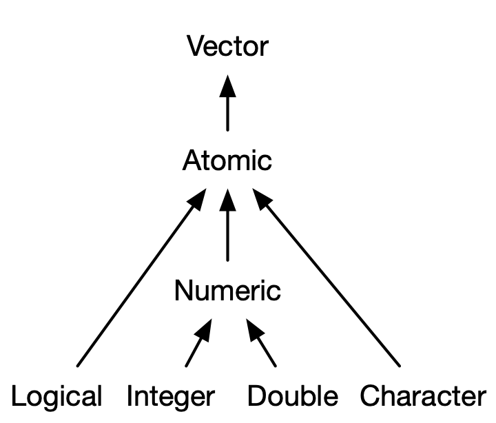

## Reading

* Text, chapters 3 and 4


# R Data Structures

## R Data Structures

- Some people think that there are four common object types store data in R: 
    - Scalars: store a single numeric value.
    - String: store a set of one or more characters.
    - Vector: store several scalar or string elements.
    - Data Frames: store several vectors (meaning that they contain several rows and columns)
- Fundamentally, all common data structures in R are **vectors**, which can 
be "**atomic**" or "**list**".
- R has no true **scalars** (a special syntax to create an individual value), everything that looks like a scalar is actually a vector of one. e.g., in `x<-1`, `x` is a vector of length one.
- Use `str()` to see the structure of an object

## Types of objects

- All R objects have a "type", that describes how it is stored
in computer memory.
- Common types we will encounter are "logical", "integer",
"double", "character" and "list".
    * Find the type of an object with `typeof()`.
    
\scriptsize

```{r}
x <- 6 # stores as double by default
typeof(x)
y <- 6L # The "L" suffix forces storage as integer  
typeof(y)
class(y)
```


## Type, class and mode

In addition to the type of an object, there is its
"mode" and "class".

- typeof() gives the type of objects from R's point of view.
- class() is used to define/identify what "type" an object is from the point of view of object-oriented programming in R. e.g., class(y) gives "integer", this means any generic function that has an "integer" method will be used. 
- mode() gives the type of object from the point of view of Becker, Chambers and Wilks (1988). 
    - More compatible with other S implementation. 
    - The mode of an object is generally the same as its type,but the modes are coarser. For example, integer and double types are both of mode "numeric".


\scriptsize

```{r}
c(mode(x) ,mode(y) )
```

\normalsize 
Reference: [Stack overflow discussion thread](https://stackoverflow.com/questions/29787850/how-do-i-add-a-url-to-r-markdown)


# Vectors 

## Vectors
\small

- Two types of vector: can be either atomic or list
    - **Atomic**: all elements must be the same type.
    - **List** ("generic vectors"): objects can be of different types. 
    - (low-key third type) `NULL`: absence of vector. 
    
 {width=50%}

## The null object

- The null object, `NULL`, is an un-typed no-value object.
    - Test for `NULL` with `is.null()`
    - `NULL` can be used to initialize objects 
    that will be created through combining, rbinding, etc.
    
\footnotesize

```{r}
x <- NULL; is.null(x)
x <- c(x,1); x <- c(x,2); x 
# etc., or as a loop (more on these later)
x <- NULL
for(i in 1:2) {
  x <- c(x,i)
}
x
```

## Types of atomic vector

Four primary types of atomic vectors: 

1. Logical: either be written in full (`TRUE` or `FALSE`), or abbreviated (`T`,`F`)
2. Integer: exactly an integer. Assign them by adding `L` behind it (for "long integer"). e.g., -1L, 0L, 1L, 2L, etc.
3. Double: decimal numbers. e.g., 1, 1.0, 1.02 ... Note that `Inf`, `-Inf`, `NaN` are also doubles.
4. Character: anything in quotes. 

Integers and doubles are together called ``numeric"

 {width=38%}

## Creating empty vectors and combining vectors

- Use `vector()` to create an empty vector

\scriptsize

```{r}
avec <- vector(mode="double",length=4) # shorthand: avec <- double()
lvec <- vector(mode="list",length=3)  # shorthand: levc <- list()
```

\normalsize

- Use `c()` to combine vectors

\scriptsize

```{r}
avec <- c(54,210,77)
lvec <- list(54,210,c("grey","thin"))
c(avec,c(100,101))
c(lvec,TRUE)
```

## Lists and combining lists

* Lists are like vectors except each element of it can be of any type. 
* `c()` concatenates two lists, which may or may not be what you intend.

\scriptsize

```{r}
ll1 <- list(a=1:2,b=3:4); ll2 <- list(a=5:6,b=7:8)
c(ll1,ll2) # not the same as list(ll1,ll2)
```


## 

* if you use `c()` with a list and a vector,  then it will first coerce the vector into a list where each element is a list.

\scriptsize

```{r}
ll1 <- list(a=1:2,b=3:4); 
c(ll1,c("c","d"))  # same as: c( ll1, as.list(c("c","d")) )
```

\normalsize 
* Use unlist() to remove the list structure.

\scriptsize

```{r}
unlist(ll1)
```

##

* A list of lists:

\scriptsize
```{r}
c(list(ll1),list(ll2)) # keep this in mind for the project
```

## Determine type and length of a vector

- You can determine the type of a vector with `typeof()`
- The special values (infinite and undefined values): `Inf`,`-Inf`, and `NaN` are doubles. Test for `Inf` and `NaN` with `is.infinite()` and `is.nan()`.
- You can check the specific type with `is.logical()`,`is.integer()`,`is.double()`, and `is.character()`.
- Missing values are represented by `NA` which is technically a logical value. 
    - This rarely matters because logicals get coerced to other types when needed. 
    - Never use `==` when testing for missingness. It will return `NA` since it is always unkown if two unknowns are equal.
    - Test for and set missing values with `is.na()`. 
- Attempting to combine vectors of different types coerces them to the same type. The order of preference is character>double>integer>logical. 

##

\scriptsize

```{r}
typeof(list(a=2,b=3))
x <- 1:3; typeof(x)
length(x)
is.integer(x)
typeof(NA)
typeof(c(1L, NA)) # logicals get coerced to other types
typeof(c(Inf,-Inf, NaN)) 
typeof(c(2L,TRUE, 98.0)) # different types coerces to the same type
```

## Test your knowledge

Predict R output for the following R code

\scriptsize

```{r, eval=FALSE}
x <- c(1,2,3, NA)
typeof(x)
is.na(c(1,2,3, NA))
is.na(x) <- 2 # set 2nd element of x to be NA
x
is.finite(c(1,Inf,-Inf, NaN))
is.infinite(c(1,Inf,-Inf, NaN))
is.nan(c(1,Inf,-Inf, NaN))
typeof(c("hello",9L, TRUE)) 
# exercise from Advanced R 
c(1, FALSE)
c("a", 1)
c(TRUE, 1L)
1 == "1" # TRUE
-1 < FALSE # TRUE
"one" < 2 # FALSE
```

## Vector attributes

- Attributes are meta information applied to atomic vectors.
- Many common objects (like matrices, arrays, factors, date-times) are just atomic vectors with special attributes.
- Vectors have type,length and, optionally, attributes such as names. 
- You get and set attributes with `attr()`.
- You could see all attributes of a vector with `attributes()`. 
- Attributes are name-value pairs, and all of the attributes are associated with an object. Below, the vector c(1,2,3) points to two attributes x and y that each have their own values. 

\scriptsize
```{r}
a <- 1:3
attr(a,"x") <- "abecdf"
attr(a, "y") <- 4:6
attributes(a) # display all attributes
# attr(a, "x") # retrieve the x attributes of vector a 
```


## 

 - Set many attributes at the same time with `structure()`
 
 \scriptsize
```{r}
b <- structure(1:3, x = "abcdef", y=4:6)
attributes(b)
b # after operation
```

\normalsize

 - Most attributes are typically lost by most operations except **names** and **dim**
 
  \scriptsize
```{r}
attributes(b[[1]])
attributes(sum(b))
```
 
## Vector attribute - names

- Names: a character vector giving each element of the vector a name. Each name corresponds to a single element.
- You could set names using `attr()`, but you should not.

\scriptsize

```{r}
#This method is not recommended
x <- 1:3
attr(x, "names") <- c("a","b","c")
x
attributes(x)
names(x)
```


## 

- Names are so special, that you could specify element names when creating a vector. 

\scriptsize

```{r}
x <- c(a=1, b=2, c=3)
x
attributes(x)
names(x)
# alternatively
x <- 1:3
names(x) <- c("a","b","c")
x

x+2:4 # names attribute is preserved 

```

## 

- Names stay with single bracket subsetting (not double bracket subsetting).

\scriptsize

```{r}
names(x[1])
names(x[1:2])
names(x[[1]])
```

\normalsize 
- Names can be used for subsetting (more in chapter 4)
\scriptsize

```{r}
x[["a"]]
```

\normalsize 

- we can remove names with `unname()`

\scriptsize

```{r}
unname(x)
```

## 

- Attributes tend to be dropped after operation. If not, they may not make sense.

\scriptsize

```{r}
x <- structure(1:3,at1="abc")
y <- structure(3:1,at1="def")
x
y
x[1:2]
x*y
```


## Vector attribute -  dimension 

- the `dim` attribute makes a vector into a **matrix** (a rectangle of numbers) or an **array** (a block of numbers).
- again, you could use `attr()` to set `dim()`, but you should not. 

\scriptsize

```{r}
x <- 1:6
attr(x,'dim') <- c(2,3)
x

y <- 1:12
attr(y,'dim') <- c(2,2,3)
y
```

## 

- you should either use `matrix()` or `array()` to create these objects, or set the dimension with `dim()`

\scriptsize

```{r}
x <- 1:6
dim(x) <- c(2,3)
x
dim(x)

x <- matrix(1:6,nrow=2,ncol=3, byrow=FALSE) # byrow=FALSE,
y <- 1:12
attr(y,'dim') <- c(2,2,3)
y
```

##

- Many of the functions for working with vectors have generalisations for matrices and arrays:

{width=100%}

## 

- Instead of having `names`, arrays and matrices of `dimnames`. The dimnames of a matrix or an array is a list the same length as the number of dimensions of the array.

\scriptsize

```{r}
x <- matrix(1:12,nrow=3,ncol=4)
dimnames(x) = list( c("r1","r2","r3"), c("c1","c2","c3","c4"))
x <- array(1:12, dim = c(2, 2, 3))
dimnames(x) <- list(first = c("a", "b"),
                    second = c("c", "d"),
                    third = c("e", "f", "g"))
dimnames(x)
x
```


## 

- This is useful for subsetting, and for bookkeeping when you have data structured in a complicated multidimensional array (e.g. it is hard to remember what indexes the first vs second vs third dimensions without dimnames).
- A vector is not a matrix with 1 dimension, it has NULL dimensions.

\scriptsize

```{r}
x["a","c","g"] # easy subsetting
z <- 1:3
dim(z) # nrow() and ncol() return the same result

# Exercise: how do you get rid of the dimensions in following array?
x <- array(1:12, dim=c(2,2,3)) # two methods
```

## 

- nrow() and ncol() return the number of rows or columns of a matrix or an array. NROW() and NROW() do the same but they treat a vector as a 1-column matrix, even a 0-length vector. 

\scriptsize 
```{r}
z <- 1:3
nrow(z)
ncol(z)
NROW(z)
NCOL(z)
```

\normalsize
Exercise: predict the output

\scriptsize 

```{r, eval=F}
z0 <- NULL
NROW(z0)
NCOL(z0)
```

## Vector attribute -  `class` 

- A special attribute named `class` is a key component of the
"S3" object-oriented programming system (more on this later). 
- Get and set with the `class()` function. 
- You can set the class to `NULL` by `unclass()`.

\scriptsize

```{r}
lvec <- structure(list(age=54,hair="grey"),at1="abc",at2=1:3)
class(lvec) <- "prof"
lvec
names(lvec)
```

## S3 atomic vectors

* The *class* of an object is an important attribute that control R's S3 system for object oriented programming. 
* The class of an object will determine its behavior when you use that class in **generic** function such as `print()`, `summary()`. 
    - A generic function is a function that has different behavior based on the class of the input. 
* You could create your own S3 classes (chapter 13). Here, we will talk about some S3 classes that come with R by default. 


##

* There are four important classes of atomic vector: factors,
Dates, POSIXct and difftime. We will discuss factors. See the text, section 3.4 for information
on the others.

{width=50%}

## Factors

- The statistical concept of a factor is important in experimental 
design. 
- Factors are implemented in R as atomic vectors with attributes
`class` and `levels`:

\scriptsize

```{r}
trt <- factor(c("drug1","placebo","placebo","drug2"))
attributes(trt)
str(trt)
```

##

- The levels are coded numerically (1, 2 and 3)
with assigned labels ordered alphabetically
("drug1", "drug2" and "placebo") by default.
- You can specify an order to the factors with 
the `level` argument:

\scriptsize

```{r}
trt <- factor(c("drug1","placebo","placebo","drug2"),
              levels=c("placebo","drug1","drug2"))
trt
```


## Coercion: atomic vectors to lists

- Atomic vectors can be coerced to lists with `as.list()`:

\scriptsize

```{r}
avec = c(age=54,weight=210,height=77)
avec
as.list(avec)
```

## Coercion: lists to atomic vectors

- Lists can be "flattened" into atomic vectors with `unlist()`:

\scriptsize

```{r}
unlist(lvec)
```

\small

- Notice how the numeric values are coerced to the more flexible 
character type. 
- The order of flexibility, from least to most, is logical,
integer, numeric, character.

## Coercion: factors to atomic vectors

- We saw how to use `factor()` to coerce an atomic vector to a factor.
- Use `as.vector()` to coerce a factor back to an atomic vector. 
- The result is a character vector. You may need to use `as.numeric()` to coerce to numeric, if required.

\scriptsize

```{r}
a <-factor(c(2,1,1,2))
as.vector(a)
as.numeric(as.vector(a))
```

# Subsetting

## Subsetting and subsetting atomic vectors

**Subsetting** is taking out elements from an object.

- Subset because you only want some elements of a vector.
- Subset so you can assign new elements to that subset. 
    
Six ways to subset atomic vector 

1. Integer subsetting: put integers in brackets and it will extract those elements. R starts counting at 1.e.g., x[1],x[c(1,3)], x[order(x)],x[c(2,2,2)]
2. Negative integer subsetting: putting negative integers will return all elements except the negative elements.e.g., x[-1],x[-c(1,3)] same as x[c(-1,-3)]
3.Logical vector subsetting: wherever there is a TRUE will return the element. x[c(TRUE,FALSE)]
4. No subsetting: x[] will return the original object. 
5. zero subsetting: x[0] will return a zero-length vector.
6. Name subsetting: subset using those names in quotes. 

## List subsetting

1. if you subset a list using single brackets, `[]`, you will get a sublist. You can use integers, negative integers, logicals and names as before.  
2. Using double brackets extracts a single element. 
3. A shorthand for using names inside double brackets is to use dollar signs. 

\scriptsize
```{r}
x <-list(a=1,b=2,c=3) 
x[1:2]
x[["a"]]
x$a
```


## Subsetting matrix and array

1. Include row and column indices, separated by a comma. Say M is a 3 by 3 matrix, M[1,2] takes out element at [1,2].
2. Have an empty space to get the whole row or the whole column. M[1,] takes out first row, M[,1] (same as M[1] ) takes out first column. 
3. if you want to say a matrix (not convert to a vector), use `drop=FALSE`. e.g., M[1, , drop=FALSE], M[ , 1, drop=FALSE].
4. You could subset a matrix using just a single vector of indices, it will go in column-major order. e.g. M[c(2,3)] returns values 2,3.

Subsetting arrays: similar to subsetting matrices, just add more commas. 


## Data Frame subsetting

\small
1. Data frame subsetting behaviors both like lists and like matrices.
2. It behaves like a list for `$`,`[[`, and `[` if only provide **one index**. The columns are the elements of the list.
3. It behaves like a matrix if you provide two indices. 
4. You can keep the data frame structure by using `drop=FALSE`
5. It is common to using filter by rows by using the matrix indexing. 

\scriptsize 
```{r}
df <- data.frame(a = 1:3,b = c("a", "b", "c"), c = 4:6)
df[1:2,2] # behaves like a matrix
df[1:2,2, drop=F]
df[df$a<3,]
```


## Subsetting with `[`

- Subset with `[`:

\scriptsize

```{r}
lvec <- list(age=54,weight=210,height=77,hair=c("grey","thin"))
attributes(lvec)
attr(lvec,"at1") <- "abc";attr(lvec,"at2") <- 1:3
attributes(lvec)
lvec[c(1,3)] # same as lvec[c("age","height")]
```


## Take care using `[[` for lists


- Extract individual elements with `[[`, or `$` for named objects:

\scriptsize

```{r}
lvec[[4]]
lvec$hair
```

\normalsize 

- `[[ ]]` (and `$`) can only return one item at a time. Trying 
to extract more than one has unexpected results.

\scriptsize

```{r}
lvec[[c(4,2)]] # the [[2]] element of lvec[[4]] !!
# Error when you do this: lvec$c("hair","weight")
```

## Subsetting factors

- Subsetting may remove all instances of a level, but the 
level will be retained in the data structure

\scriptsize

```{r}
trt[1:3]
```

\normalsize

- If subsetting is intended to remove a level of the factor, use `drop=TRUE`

\scriptsize

```{r}
trt[1:3,drop=TRUE]
```

## Subsetting and assignment

- You can combine subsetting and assignment to change 
the value of vectors. 

\scriptsize

```{r}
avec
avec[2] <- 220
avec
```

## Assignment to vector elements

* To assign to a vector element, it is clearer to use `[[` rather than `[`.
    - Also, for lists, assignment with `[` requires that the replacement 
    element be of length 1; `[[` 
    does not have this restriction
    
\scriptsize

```{r}
lvec[3:4] <- c("Hi","there")
lvec[3:4]
```

##

\scriptsize

```{r}
lvec[4] <- c("All","of","this")
lvec[4] # Only used first element of replacement vector
lvec[[4]] <- c("All","of","this")
lvec[3:4]
```


# Matrices, data frames and tibbles

## Matrices and data frames

- Matrices are implemented as atomic vectors with a "dim" attribute of
length 2  (number of rows, number of 
columns).
- As an atomic vector, elements of a matrix must all be of the same type.
- Data frames are lists where each list element
has the same length. Thus data frames can include columns
of varying type.

## Matrices

- Matrices can be created with the `matrix()` function as in 
\scriptsize

```{r}
A <- matrix(1:4,nrow=2,ncol=2) 
A
```

\normalsize

- Here `1:4` is the same as `c(1,2,3,4)`

##

- The default is to read the data vector into the matrix column-by-column. To 
read row-by-row instead use the `byrow=TRUE` argument:

\scriptsize

```{r}
A <- matrix(1:4,nrow=2,ncol=2,byrow=TRUE) 
A
A <- matrix(c( 1, 2, 
               3, 4),ncol=2,nrow=2,byrow=TRUE)
```

## Combining matrices


- Combine matrices with `rbind()` and `cbind()`:

\scriptsize

```{r}
rbind(A,matrix(c(5,6),nrow=1,ncol=2))
cbind(A,A)
```

## Matrix attributes

- Matrices have a type, dimension and optional attributes such as dimnames (row and column names).

\scriptsize

```{r}
typeof(A)
dim(A)
```

##

\scriptsize

```{r}
colnames(A) <- c("var1","var2")
rownames(A) <- c("subj1","subj2")
A
str(A)
```

## Subsetting matrices 
\footnotesize

- Subset with `[` and a comma to separate rows from columns:
```{r}
A[1,1]
A[1,]
A[,1]
```
- When a subsetting operation leads to a vector, the dimension 
of the object is "dropped" from 2 to 1. To prevent this use
`drop=FALSE`:
```{r}
A[1,,drop=FALSE]
```


## Extracting elements from matrices 
\footnotesize

- Can use `[[` to extract elements, but this is not necessary 
because of the way subsetting to a single element drops to 
a vector of length 1 by default:
```{r}
A[[1,1]]
A[1,1]
```

## Coercion: Matrices to/from vectors

- We have already seen how `matrix()` coerces a vector to a matrix
- `as.vector()` applied to a matrix removes the dim attribute and 
creates a vector by concatenating columns:

```{r}
A
as.vector(A)
```

##  Data frames
\small

- Data frames (class `data.frame`) are the usual way to 
store data in R.
    - Rows are intended to be observational units, columns variables
    - Implemented as a list (columns are list elements), but also behave like a matrix in terms of combining and subsetting.
- Create with `data.frame`:

\scriptsize
```{r}
set.seed(1)
n <- 4
x <- 1:n; y <- rnorm(n,mean=x,sd=1) # multiple commands separated by ;
dd <- data.frame(x=x,y=y) # like making a list
str(dd)
dd
```

## Row and column names

* Get and set with `rownames()` and `colnames()`, respectively.
* `names()` also gets and sets the column names
* `rownames()` and  `row.names()` both can the row names of a matrix or a dataframe, but for a data frame, value for rownames should be a character vector of non-duplicated and non-missing names (this is enforced).

\scriptsize

```{r}
colnames(dd); names(dd)
rownames(dd) <- paste0("subj",1:nrow(dd))
rownames(dd)
```


## Subsetting data frames like a list

\scriptsize

```{r}
dd$x 
dd[[1]]
dd[1] # also try dd[1,]
c( typeof(dd$x),typeof(dd[[1]]),typeof(dd[1]) )
c( class(dd$x), class(dd[[1]]), class(dd[1]) )
```

## Subsetting and combining data frames like a matrix

\scriptsize

```{r}
dd[1:2,]
zz = data.frame(z=runif(4))
cbind(dd,zz)
```

## tibbles

* A tidyverse replacement (or extension) of the data frame 
with different default behaviour.
* See section 3.6 for a discussion of some of the differences.

\scriptsize

```{r}
library(tibble)
tt <- tibble(x = 1:3, y = letters[1:3])
typeof(tt)
attributes(tt)
```

## More on subsetting

* one-dimensional subsets of data frames are coerced to atomic
vectors, but not so with tibbles.

\scriptsize

```{r}
dd[,1]; dd[1,1]
tt[,1]; tt[1,1]
```


## List columns

* One way that tibbles improve on data frames is easier handling
of columns whose elements are lists.

\scriptsize

```{r}
tibble(
  x = 1:3, 
  y = list(1:2, 1:3, 1:4) # lists of different length on each subject
)
```


# Logical  and relational operators
## Logical operators
\small

- The basic logical operators are described in `help("Logic")`.
- `!` is NOT
- `&` and `&&` are AND, with `&` acting vector-wise and `&&` acting 
on scalars
- `|` and `||` are OR, with `|` acting vector-wise and `||` acting 
on scalars
- Make sure you understand the following:

\scriptsize
```{r}
x <- c(TRUE,TRUE,FALSE); y <- c(FALSE,TRUE,TRUE)
!x ; x&y ; x&&y ; x|y ; x||y
```

## 

- Notice how `&&` and `||` act on the first element of the vectors
`x` and `y` and ignore all the rest.


## Relational operators
\small

- Relational operators can be used to compare values in atomic vectors
    - See `help("Comparison")`
- `>` is greater than, `>=` is greater than or equal
- `<` is less than, `<=` is less than or equal
- `==` is equal and `!=` is not equal
- Make sure you understand the following:

\scriptsize
```{r}
x <- 1:3; y <- 3:1
x>y ; x>=y ; x<y ; x<=y ; x==y ; x!=y
```


## Subsetting vectors with logical expressions
\footnotesize

- Can subset with logicals and `[`:
```{r}
avec
avec>100
avec[avec>100]
avec[avec>54 & avec<100]
```

## Subsetting matrices with logical expressions

- Can also subset matrices, but results may not be as expected:
```{r}
A
A>1
A[A>1] # coerces to a vector
```

## Subset and assign with logical expressions
\footnotesize

- Combine subset and assign to change the value of objects
```{r}
A[A>1] <- 9
A
```
- In the above substitution, the vector 9 is shorter than the 
three elements in `A>1` so R "recycles" the 9 three times. 

## Be careful about recycling:

\footnotesize

```{r}
A[A>1] <- c(-10,10) # Throws a warning 
A # R used c(-10,10), then just the -10 
```

