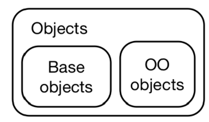

## Introduction to object-oriented programming (OOP) in R

* Reading: Text, OOP Intro, Chapters 12 and 13
* Topics:
    * general comments on OOP
    * terminology
    * base objects vs OO objects
    * OOP with "S3" in R

## Object-oriented vs functional programming

* OOP aims to break a problem down into components
that are represented by "objects".
    * An object contains its data and the functions, or "methods"
    that can act on that data
* R is predominantly a functional programming language:
we break a problem down into functions.
* The debate over which stlye of programming is the best rages on.
    * Google "functional versus object-oriented programming" for a sample
* Practical note: algorithms and data structures go hand-in-hand for solving 
complex problems, and formalizing your data structure as an object is useful.

## OOP in R 

* Much of R uses OOP in some form, so if you want to contribute to,
extend, or just understand someone else's code you should learn
a little OOP.
* We will discuss three OOP systems: S3, R6 and S4.
    * S3 is the simplest and most widely used. The text calls it
    "functional" OOP. 
    * RC and R6 are traditional "encapsulated" OOP systems that
    looks less familiar to R users but more familiar to programmers 
    from OO languages (eg, java, Python, C++, c\#, Ruby  and etc).
    * S4 is a more formal version of S3
* Our goal is to learn a little about each style so that we can 
understand code written by others.
* For our project we will use S3.
    * Our MARS function will output an S3 object, and we will write
    print, summary, plot and other methods to make the interface
    familiar to R users.
    

## Why use S3?

* Very minimalist and flexible.
* Widely used, so others can understand your code.
* OOP can evolve as you work. 
    * Just like R is good for prototyping functional algorithms,
    S3 is good for prototyping OOP methods.
    * If your code needs more structure (e.g., you are
    starting to open it up to collaborators), you
    can formalize your OOP then.
* It "looks like R"


## A quick intro to OO systems

* An OOP system makes it possible for any developer to extend the interface with implementations for new types of input. 
* OO Systems call the type of an object its **class** (a class defines what an object is).
* An implementation for a specific class is called a **method** (methods decribe what the object can do).
* Class are organized in a hierarchy so that if a method doesn't exist for one class, its parent's method is used, the and the child is said to **inherit** behavior. Eg. a GLM model inherits from a linear model. 
* The process of finding the correct method given a class is called **method dispatch**. 


## Terminology: polymporhism and encapsulation

* **polymorphism** (literally: many shpaes): As we've seen, functions like plot are generic and behave differently
when given different inputs; this is called polymorphism. Another example, summary() for either numeric or factor variables.
* **encapsulation:** We hide the details of an object behind an
interface.
    * Encapsulated OOP formally bundles data and methods used to
    set and get data values; methods are called as `object.method(args)`.
    * Functional OOP provides "generic" functions that the user *should* use
    to get and set data; generic functions are called
    as `generic(object,args)` and "method dispatch" is used
    to find the correct method (more on this later).
    * Encapsulation allows the developer to change the implementation of 
    the object without breaking other code: just change the 
    relevant methods for getting and setting data.

## Example of functional OOP

\small

```{r}
data(mtcars)
ff <- lm(mpg~disp,data=mtcars)
class(ff)
# names(ff)
# ff$residuals
# residuals(ff)
# residuals
# summary(ff)
```


## Terminology, continued

* We have been using the terms **class** and **method**.
* Other important terms:
    * **fields:** are the data of the class
    * **inheritance:** Classes can be organized in a hierarchy that we 
    search for an appropriate method. If a method does not exist for
    a child, or sub-class and we use the method from the parent, or super-class,
    then the child is said to inherit behaviour from the parent. 
   * **method dispatch** is the process of finding an appropriate method
   for a given class


## Base objects vs OO objects

* We have been using "object" to describe
data and functions in R in general, but not all objects are object-oriented.
* Technically, the difference between base and OO objects is that OO objects have a “class” attribute:

{width=25%}

\scriptsize

```{r}
x <- 1:4
attr(x,"class") # compare with class(x) -- misleading
attr(mtcars,"class")
attr(ff,"class")
```

##

\scriptsize

```{r}
is.object(x)
is.object(mtcars)
is.object(ff)
```


## Base types

* Recall that base objects have a base type that you can 
discover with `typeof()`. 
* There are 25 base types 
* These types describe the underlying implementation of the
base object in memory, and functions that behave differently 
for different base types are coded with switch statements.
* See the text, section 12.3 for more details on base object
types.


## OOP with S3

* S3 is an informal OO system and the most commonly-used.
    * E.g, it is the only OO system used in base R and the R stats package.
* Without strict rules, you have a lot of freedom, but can also write
bad code.
* We will discuss conventions for creating useful classes and methods
* We will use the `sloop` package recommended by the text to 
query objects about their class and available methods.

\small

```{r}
# install.packages("sloop")
library(sloop)
```


## S3 classes

* An S3 class is a base type with a class attribute

\scriptsize

```{r}
f <- factor(c("cat","dog","mouse"))
typeof(f)
attributes(f) # see also class(f) and inherits(f,"factor")
otype(f) # from sloop
s3_class(f) # from sloop
```

## Creating your own class

* Use `class()` to set the class after the object
has been created, or use `structure()`:

\scriptsize

```{r}
new_node <- function(data,childl=NULL,childr=NULL){
  structure(list(data=data,childl=childl,childr=childr),
                class="node")
}
nn <- new_node(data=NULL) # Note: data should be a region object
s3_class(nn)
```

In MARS
```{r,eval=F}
mars <- function(formula,data,control=mars.control()) {
  ...
  fwd <- fwd_stepwise(y,x,control)
  bwd <- bwd_stepwise(fwd,control)
  fit <- lm(...)
  out <- c(list(call=cc,formula=formula,y=y,
                B=bwd$B,Bfuncs=bwd$Bfuncs,
                x_names=x_names),fit)
  class(out) <- c("mars",class(fit))
  out
}

```

## Removing the class attribute

* We can simply remove the class with `attributes(f)$class <- NULL`
but it is better to use `unclass()`.

\small

```{r}
print(unclass(f))
otype(unclass(f))
```


## Class conventions

* No rules, but the text suggests a few conventions.

* Naming: Any string is OK, but stay away from `.`, which is 
the separator between generic and class names in naming methods.

* Constructor: Make a function named
`new_myclass()` to create an object with the correct 
structure. 
* Validator: Make a function named `validate_myclass()` that
checks that the object's data makes sense, stops if not,
and otherwise returns the object.
* Helper: Make a function named `myclass()` that users
can use to create instances of the class. 

* Exercise (see week 7 exercises): 
Create validator and helper functions for the
node class example on the previous slide.


## Three functions to create your own class 

The text recommends you provide three functions to create your own class

1. A low-level **constructor**,`new_myclass()`, that efficiently creates new objects with the correct structure.
2. A **validator**, `validate_myclass()`, that performs more computationaly expensive checks to ensure that the object has correct values.
3. A user-friendly **helper**, `myclass()`, that provides a conveinent way for others to create objects of your class.

## Constructors

* Text: The constructor should
    * Be called new_myclass().
    * Have one argument for the base object, and one for each attribute.
    * Check the type of the base object and the types of each attribute.

* Note: I often write constructors whose base object is
a list, and my constructor has separate arguments for
each list element. 
    * See the `new_node()` function, for example
    * This goes against the second of the 
above conventions. 

## Example constructor

* From the text: Make a constructor for the S3 class `difftime` 

\scriptsize

```{r}
new_difftime <- function(x = double(), units = "secs") {
  stopifnot(is.double(x))
  units <- match.arg(units, c("secs", "mins", "hours", "days", "weeks"))

  structure(x,
    class = "difftime",
    units = units # set a "units" attribute
  )
}
new_difftime(c(1, 10, 3600), "secs")
new_difftime(52, "weeks")
try(new_difftime(1,"eon"))
```
    
## Notes on constructors

* Think of the constructor as a function to be used
by you or other knowledgeable users.
    * Don't need extensive checking
* Time-consuming checks should go in the validator ...


## Validator

* Write a validator, `validate_myclass()` if checking the validity of
the object's data may be computationally expensive.

\scriptsize

```{r}
validate_difftime <- function(x) {
  # if(bad_thing(x)) stop("Bad thing has happened")
  x # return object if it passes all checks
}
```


## Helper

* This is for ordinary users.
* Should have the same name as the class.
* Should have as many defaults as practical to 
make it easy to use.
* Should call the validator, if one exists.

\scriptsize

```{r}
difftime <- function(x = double(), units = "secs") {
  x <- as.double(x) # try coercing input to required double
  x <- validate_difftime(x) # validate
  new_difftime(x, units = units) # call constructor
}
```

## Example: class mars.control

\scriptsize

```{r,eval=F}
# constructor, validator and helper for class mars.control
new_mars.control <- function(control) {
  structure(control,class="mars.control")}

validate_mars.control <- function(control) {
  stopifnot(is.integer(control$Mmax),is.numeric(control$d),
            is.logical(control$trace))
  if(control$Mmax < 2) {
    warning("Mmax must be >= 2; Reset it to 2")
    control$Mmax <- 2}
  if(control$Mmax %% 2 > 0) {
    control$Mmax <- 2*ceiling(control$Mmax/2)
    warning("Mmax should be an even integer. Reset it to ",control$Mmax)}
  control
}

# Constructor for `mars.control` objects
mars.control <- function(Mmax=2,d=3,trace=FALSE) {
  Mmax <- as.integer(Mmax)
  control <- list(Mmax=Mmax,d=d,trace=trace)
  control <- validate_mars.control(control)
  new_mars.control(control)
  }
# mars <- function(formula,data,control=mars.control(Mmax=4)) {...}
```

## S3 generic functions and methods

* The job of S3 generic is to perform method dispatch, i.e. finding the
specific implementation for a class. Method dispatch is performed by `UseMethod()`.
* A generic function, like print, defines an 
interface (arguments) and finds an appropriate method
    * the method is an implementation specific 
    to the object class
    * finding an appropriate method is method dispatch

\small
```{r}
print
ftype(print)
ftype(print.factor)
```


## Method dispatch: `UseMethod()`

* `UseMethod()` takes two arguments: the name of the generic function (required), and the argument to use for method dispatch (optional). If you omit the second argument, it will dispatch based on the first argument, which is almost always what is desired
* In simple cases, `UseMethod()` looks for  `generic.class()`,
and falls back on `generic.default()`. 
    * If neither exist, it throws an error.

* When a class inherits from a parent
class, the search gets more complicted.

## Example: print methods

* When you type the name of an object in the R console
you invoke print. 
* Different print methods exist for different classes of objects.
    * How many?

\small

```{r}
s3_methods_generic("print") # a lot!
```

## Example: print.factor

* Most S3 methods are not exported from the packages in 
which they are defined, but you can view them
with sloop.

\tiny

```{r}
s3_get_method("print.factor")
```


## Writing methods when there is a generic

* Just write a function with name generic.class
    * See our `print.region()` method from lab 3.
* The method should have the same arguments
as the generic.
    * In the case of `print()` there is just one required argument, the object to be printed.

## Writing a generic

* Just need a call to `UseMethod()`

\small

```{r}
plot_regions <- function(x,...)   UseMethod("plot_regions")
plot_regions.tree <- function(tree){
  # set up empty plot
  plot(tree$data$x[,1],tree$data$x[,2],xlab="X1",ylab="X2") 
  plot_regions.node(tree$childl)
  plot_regions.node(tree$childr)
}
# add plot_regions.node(), recpart() then test
```

## Using inheritance

* Our MARS objects will contain the 
output of the final call to `lm()`. 
* Can make lm the parent class of our MARS objects.
    * Toy example:
    
\small

```{r}
new_mars <- function(formula,data) {
  ff <- lm(formula,data)
  structure(c(ff,list(ID="Hi, I'm a MARS object")),
            class=c("mars",class(ff)))
}
mm <- new_mars(mpg~cyl,data=mtcars)
s3_dispatch(print(mm))
```

## Further reading

* If you are interested in reading more about 
S3 classes on your own, see chapter 13 of the
text.
* Topics we skipped or skimmed:
    * Object styles (section 13.5)
    * Inheritance: NextMethod() and subclassing (section 13.6)
    * Dispatch details (section 13.7)